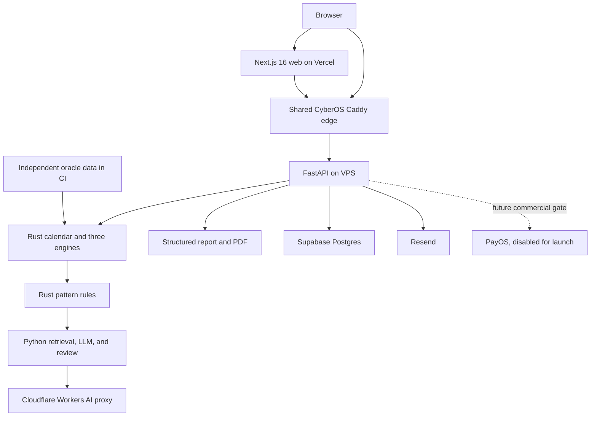

# Strategem production completion and verification plan

## 1. Executive assessment

Strategem is a broad product prototype with passing local checks, but it is not ready for production release.

Verified baseline on commit `6fb8731ba95741c7c6c644959378cc6b3a57324b`:

- Rust formatting, Clippy, and 201 workspace tests passed. Cargo warned that two `regen_cert_keys` examples produce colliding output names.
- Python lint and formatting passed. Mypy passed across 238 source files. Pytest passed 311 tests, skipped 9 database-dependent tests, and emitted one deprecation warning.
- Web type checking, lint, build, and the 16 scripts named by `pnpm --filter web test` passed. Twelve other test files are omitted. Most included checks inspect source text rather than rendered behavior.
- The Next.js build warned that `middleware` is deprecated in favor of `proxy`, and `metadataBase` is missing.
- The worktree was not changed. Existing untracked `.devin/` and `.windsurf/` directories remain untouched.

Current stop-ship conditions are:

- Anonymous and authenticated cast ownership paths are broken.
- User-facing API failures can become unlabeled demo content.
- Flagged AI interpretation is released before review.
- Missing payment credentials can grant Premium through mock mode.
- The documented database login can bypass RLS.
- Auth recovery, privacy, reviewer, curator, and Enterprise workflows are incomplete or process-memory only.
- Production promotion is not gated by required checks or human review.
- Staging, rollback, restore, monitoring, and safe production testing lack working evidence.
- The task ledger says everything is done while the implementation and acceptance evidence disagree.

Locked product decisions:

- Paid checkout is disabled for the first release. Free use and a real waitlist remain available. PayOS cannot be enabled until price, term, refund, invoice, and tax policy are approved.
- Anonymous casts remain in browser session storage only. They are not written to server storage. Sign-in and email verification are required for reports, history, follow-up, sharing, and other saved features.
- Signed-in, verified casts auto-save. Users can pin or delete them.
- Shared views use opaque, read-only, redacted links. Default expiry is 7 days, with owner revocation and access audit.
- Health, financial, and legal questions are always withheld for review. Any interpretation below 0.55 confidence is also withheld. Reviewer target time is 24 hours.
- Resend supplies verification, recovery, review, and waitlist email.
- Social account linking requires reauthentication and explicit consent.
- Reviewer and curator are separate roles. Admin assigns them but does not silently inherit their decision authority.
- Localized routes use `/vi`, `/en`, and `/zh`.
- Enterprise API keys are included in the release.
- Production uses the shared CyberOS Caddy edge.
- Production promotion requires all gates and one reviewer. Admin bypass is disabled.
- Live curated RAG is required. A cited deterministic fallback is allowed only as a clearly labeled outage response.
- Public launch remains blocked until counsel records the exact retention, erasure, legal-hold, and backup treatment rules.

"Complete" means every approved flow has implementation, automated coverage, staging evidence, an environment-appropriate production check, and no unresolved release-blocking defect.

## 2. Product and current architecture map

Strategem is a heritage-education and decision-support product for QiMen, LiuRen, and TaiYi. Its canonical product areas are lookup, learning, management, strategic analysis, and internal review or curation.

The intended cast path is: validate identity and input, resolve the calendar, execute the selected deterministic engine, detect patterns, retrieve approved sources, generate cited interpretation, apply review policy, assemble a report, return safe output, then persist authenticated results and audit data.

Current trust boundaries are browser to Vercel or VPS, FastAPI to the cast executable, FastAPI to Supabase, FastAPI to the configured LLM endpoint, Resend callbacks, PayOS webhooks, and human reviewer or curator decisions.

Key repository evidence:

| ID | Evidence |
|---|---|
| E01 | Architecture and product invariants: [tam-thuc-unified-plan-2026-07-08.md](/Users/stephencheng/Projects/CyberSkill/strategem/docs/strategy/tam-thuc-unified-plan-2026-07-08.md:71) |
| E02 | Public and protected API policy: [authz.py](/Users/stephencheng/Projects/CyberSkill/strategem/packages/tamthuc_api/src/tamthuc_api/authz.py:28) |
| E03 | Cast and result client behavior: [client.ts](/Users/stephencheng/Projects/CyberSkill/strategem/apps/web/src/lib/api/client.ts:72) |
| E04 | Report mock fallback: [report.ts](/Users/stephencheng/Projects/CyberSkill/strategem/apps/web/src/lib/api/report.ts:49) |
| E05 | History mock fallback: [history.ts](/Users/stephencheng/Projects/CyberSkill/strategem/apps/web/src/lib/api/history.ts:16) |
| E06 | Payment mode and fulfillment: [payments.py](/Users/stephencheng/Projects/CyberSkill/strategem/packages/tamthuc_api/src/tamthuc_api/routes/payments.py:81) |
| E07 | Current Postgres query store: [pg_store.py](/Users/stephencheng/Projects/CyberSkill/strategem/packages/tamthuc_api/src/tamthuc_api/pg_store.py:57) |
| E08 | Review release behavior: [gate.py](/Users/stephencheng/Projects/CyberSkill/strategem/packages/tamthuc_rag/src/tamthuc_rag/review/gate.py:19) |
| E09 | Mounted auth routes: [routes.py](/Users/stephencheng/Projects/CyberSkill/strategem/packages/tamthuc_auth/src/tamthuc_auth/routes.py:26) |
| E10 | School and calendar settings: [school-flags.ts](/Users/stephencheng/Projects/CyberSkill/strategem/apps/web/src/lib/flags/school-flags.ts:128) |
| E11 | VPS deployment workflow: [deploy-vps.yml](/Users/stephencheng/Projects/CyberSkill/strategem/.github/workflows/deploy-vps.yml:7) |
| E12 | VPS deployment script: [deploy.sh](/Users/stephencheng/Projects/CyberSkill/strategem/deploy/vps/deploy.sh:10) |
| E13 | Production migration script: [migrate.sh](/Users/stephencheng/Projects/CyberSkill/strategem/deploy/vps/migrate.sh:23) |
| E14 | Journey workflow: [product-journeys.yml](/Users/stephencheng/Projects/CyberSkill/strategem/.github/workflows/product-journeys.yml:20) |
| E15 | Process-local metrics: [metrics.py](/Users/stephencheng/Projects/CyberSkill/strategem/packages/tamthuc_api/src/tamthuc_api/observability/metrics.py:10) |
| E16 | Runtime RLS requirements: [session.md](/Users/stephencheng/Projects/CyberSkill/strategem/db/rls/session.md:37) |
| E17 | Live-truth task audit: [2026-07-25-live-truth-audit.md](/Users/stephencheng/Projects/CyberSkill/strategem/docs/tasks/_audits/2026-07-25-live-truth-audit.md:22) |
| E18 | Release checklist: [SHIP_CHECKLIST.md](/Users/stephencheng/Projects/CyberSkill/strategem/docs/deploy/SHIP_CHECKLIST.md:89) |
| E19 | Cloudflare AI proxy: [index.js](/Users/stephencheng/Projects/CyberSkill/strategem/deploy/cloudflare/strategem-llm-proxy/src/index.js:1) |
| E20 | Current education practice UI: [page.tsx](/Users/stephencheng/Projects/CyberSkill/strategem/apps/web/app/practice/page.tsx:26) |

A read-only production check on 2026-07-28 found hosted Postgres 17, applied custom migrations, synthetic smoke residue, and RLS or indexing advisor findings. This state must be re-attested at release time. The database plan follows the [Supabase production checklist](https://supabase.com/docs/guides/deployment/going-into-prod) and [Supabase RLS guidance](https://supabase.com/docs/guides/database/postgres/row-level-security).

## 3. User-role and permission matrix

| Actor | Allowed target behavior | Explicit limits |
|---|---|---|
| Anonymous | Public pages, education reads, one ephemeral single-system cast, locale and theme stored in browser | No server persistence, report, history, follow-up, share, strategic tools, or account data |
| Unverified account | Anonymous capabilities, verification resend, logout, account correction | No saved feature, Premium action, Enterprise key, or operational role |
| Free | Owned single-system casts, reports, PDF, history, settings, learning progress, privacy actions | No all-system cast, timing, scenario, cross-system, or operational queue |
| Premium | Free capabilities plus all-system cast and strategic tools | No Enterprise key or internal operation |
| Enterprise | Premium capabilities plus scoped API-key issue, rotation, revoke, quota, and usage history | No internal review, curation, or user administration |
| Reviewer | Review queue, claim, approve, reject, safe prose edit, review audit | Cannot edit deterministic chart data, source records, entitlements, or user roles |
| Curator | Draft, review, accept, reject, and supersede knowledge versions | Cannot approve AI review tickets or administer accounts |
| Admin | User status, role assignment, entitlement assignment, operational settings, audit access | Cannot silently approve review or curation work without the matching assigned role |
| Support or operator | Release checks, incident actions, synthetic-run cleanup, approved account support | No customer impersonation by default; any future support access needs explicit audited delegation |
| Resend | Transactional message delivery and callbacks | No product data beyond minimum template fields |
| Cloudflare Worker | Approved model proxy for RAG | Fixed model allowlist, request limits, service authentication, no arbitrary outbound target |
| PayOS | No launch access | Routes remain unmounted or return 404 until the commercial gate is accepted |

Authorization must be declared as named capabilities at route definition and tested through a route-to-capability inventory. Client route guards improve the interface, but the API and database remain authoritative.

## 4. Complete user-flow catalog

| Flow | Actor, precondition, entry, and exact target path | Data, APIs, permissions, and side effects | Current state, recovery, tests, and production check |
|---|---|---|---|
| F01 Discovery | Anonymous enters `/vi`, `/en`, or `/zh`; opens product, help, pricing, learning, or cast navigation; each link returns the matching locale and accessible heading | Static web data; no account or server mutation | Partial. Metadata and language state are inconsistent. Test every route, locale, viewport, keyboard path, 404, offline shell, and external link. Production PT-01 |
| F02 Anonymous cast | Anonymous opens `/{locale}/cast`, supplies valid datetime, timezone, longitude, question type, system, persona, and flags; submission returns one result; browser stores it under a session-only opaque ID and opens the local result view | `POST /api/v1/calculate/{system}` without persistence; no query, report, or audit content row; anonymous rate limit by trusted client IP | Broken today because the API persists under shared `anon` and result GET requires auth. On timeout or expiry, show retry or "cast again". No server fallback or demo substitution. Tests cover all systems, malformed input, duplicate submit, reload in the same session, session expiry, and zero database writes. Production PT-02 |
| F03 Registration and verification | Visitor submits email, password, locale, required consent version, and optional marketing consent; receives generic success; Resend delivers a single-use link; confirmation activates saved features | Versioned auth endpoints, hashed token row, consent rows, email delivery record, auth audit, IP and email rate limits | Partial test helpers only. Unknown and known email responses must match. Tests cover expiry, resend invalidation, concurrent confirmation, restart, delivery failure, and verification before saved access. Production PT-03 |
| F04 Login and session restoration | Verified user logs in; access token stays in memory; refresh token stays in a Secure, HttpOnly, SameSite cookie; cold load refreshes once; logout revokes the server session and clears all tabs | Login, refresh, me, logout, session list, revoke-one, revoke-all; refresh-family rows and audit | Broken after access expiry. Test rotation, reuse detection, multi-tab logout, multi-device revoke, CSRF, Origin checks, API outage, and revoked user. Production PT-04 |
| F05 Password recovery and social login | User requests reset without account disclosure, uses a single-use link, resets password, and loses every prior session. Google or Apple sign-in verifies OIDC. Matching password accounts require reauthentication and explicit linking approval | Resend, OIDC discovery and JWKS, nonce, state, PKCE, provider-subject table, token-family revocation | Missing or test-only. Disable social routes until real verification is configured. Test issuer, audience, nonce, stale key, unverified provider email, duplicate subject, linking denial, and provider outage. Production PT-05 |
| F06 Verified single-system cast | Verified Free or higher user submits one system; Bearer principal is attached even though the route also permits anonymous use; result, charts, report state, flags, and audit commit in one transaction; result opens by owned ID | Calculate route, canonical persistence tables, review policy, RAG, report assembly, append-only audit | Broken because the web omits auth and persistence falls back to `anon`. Test owner assignment, cross-user 404, retry idempotency, transaction rollback, report linkage, and history visibility. Production PT-06 |
| F07 Premium multi-system cast | Verified Premium, Enterprise, or Admin requests all systems; all engines use one calendar context and effective flag set; response identifies partial versus complete outcome under the approved failure policy | `POST /api/v1/calculate/all`, three chart rows, one query, one report state, capability `calculate_all` | Broken ownership and authorization consistency. A one-engine failure returns a typed partial result only if deterministic integrity remains clear; otherwise no partial persistence. Test all roles, engine failure, retry, and cache identity. Production PT-07 |
| F08 Result inspection and follow-up | Owner opens a result, switches beginner or expert presentation, inspects chart details and citations, then asks a follow-up grounded in the same persisted chart | Owned query GET, follow-up POST, citations, RAG, audit, rate and cost limits | Partial. Client can invent metadata or replace prose. No follow-up before review approval. Tests cover missing metadata, unauthorized access, LLM outage, citation failure, token expiry, and question injection. Production PT-08 |
| F09 Human review | Risk or confidence policy creates a pending ticket and withholds prose. Reviewer sees queue, claims ticket, approves, rejects, or safely edits with reason. User sees status until approval. A 24-hour alert fires before SLA breach | Review tables, reviewer capability, immutable outcome and audit, polling or notification, report release gate | Critical defect. Current code releases pending text and trusts client role data. Test leak prevention across API, cache, PDF, follow-up, logs, concurrent decisions, restart, role denial, and SLA alert. Production PT-09 |
| F10 Report and PDF | Verified owner opens approved report, sees deterministic and AI sections separated, downloads a valid PDF with Vietnamese and Han-capable embedded fonts | Report GET and PDF GET, owner check, download audit, parser validation | Broken truth handling because failures become mock content and renderer errors become weak PDF bytes. Return typed errors. Test 401, 403, 404, 500, timeout, valid parser, visual sample, fonts, file name, and size. Production PT-10 |
| F11 History and saved work | Verified user opens history; sees an honest empty state or cursor-paginated owned casts; filters by canonical system and question type; sorts, pins, opens, and deletes under retention rules | Query list/delete, pins and preferences, audit, canonical enums | Partial. Errors and empty state become demo data. Test empty, normal, high-volume, canonical filters, stale cursor, concurrent deletion, another user's ID, offline, and account deletion. Production PT-11 |
| F12 Settings | Verified user changes school flags, calendar flags, locale, theme, and allowed preferences; next cast receives separate typed flag objects and stamps the full effective set | Preference APIs, `co_truong_phai`, `co_lich_phap`, engine contract | Broken because calendar flags are flattened and partly ignored. Test every enum, invalid value, defaults, timezone boundaries, persistence, determinism, and old-setting compatibility. Production PT-12 |
| F13 Share and export | Owner creates a redacted link, sees 7-day expiry, copies it through an accessible dialog, views access history, and revokes it. Recipient sees only allowed result or report fields. Owner exports PDF, PNG, or SVG | Share grant and token hash, redaction snapshot, access audit, artifact routes | Broken. Current link grants no recipient access and export buttons are unwired. Test guessed token, expiry, revoke, redaction, recipient rate limit, file parsing, dialog focus, and offline error. Production PT-13 |
| F14 Timing optimizer | Verified Premium or Enterprise user submits range, place, timezone, longitude, question type, granularity, system, and flags; receives ranked windows with full explanation, citations, and cast references | Timing endpoint, capability `timing_optimize`, multiple engine calls, cost rate | Partial. Inputs and output are incomplete. Test Free denial, range limits, DST and timezone edges, empty result, partial provider outage, and reproducibility. Production PT-14 |
| F15 Scenario comparison | Verified Premium or Enterprise user adds 2 to 4 candidates, validates common context, submits, and sees complete comparison, best-overall explanation, and uncertainty | Scenario endpoint, capability `scenario_compare`, owned optional saved artifact | Partial and under-protected. Test 2, 3, and 4 candidates, duplicates, invalid combinations, Free denial, timeout, and full response rendering. Production PT-15 |
| F16 Cross-system validation | Verified Premium or Enterprise selects 2 or 3 systems, full input, and flags; receives system-specific facts and cross-system patterns without mixed identities | Cross-system endpoint, capability `cross_system_validate`, rules and engine set | Partial and Free-accessible today. Test every system subset, flag echo, one-engine failure, Free denial, and cache separation. Production PT-16 |
| F17 Pattern and graph exploration | Visitor searches accepted patterns by locale or system, opens citations and bounded graph neighbors, and distinguishes no result from service failure | Knowledge APIs, versioned corpus, graph edges, pagination, accepted-version filter | Seed-backed and process-memory. Test curation state, pagination, graph cycles, depth limit, raw citation rejection, locale fallback, and restart. Production PT-17 |
| F18 Curriculum | Visitor or verified learner opens L1 to L4. Anonymous progress can remain browser-local; verified progress is account-linked and awarded only by declared criteria | Curriculum APIs, progress events, prerequisites, locale content | Partial and inconsistent with the accepted specification. Test prerequisites, server grading, manual-review criteria, cross-device sync, revocation, and locale. Production PT-18 |
| F19 Practice | Learner selects QiMen or LiuRen exercise, enters chart-construction steps, receives per-cell differences, earliest root cause, and blocked downstream steps | Practice grade API, deterministic engine, attempt and progress records | Current UI is a fixed pattern-ID quiz. Test correct, wrong, partial, malformed, retry, root-cause location, high-volume exercises, and accessibility. Production PT-19 |
| F20 Library and citation reader | Visitor filters work, layer, system, locale, and page; opens passage with source locator; result citation deep-links to highlighted source | Library search, passage and citation resolver APIs, curated corpus | Partial seed implementation. Test missing translation, Han retention, invalid locator, pagination, search normalization, deep link, and no machine translation. Production PT-20 |
| F21 Onboarding and help | First visitor or newly verified user receives role-aware onboarding; dismiss or completion persists at the proper scope; help search returns localized approved content | Onboarding state, help content, optional account preference | Partial and browser-local. Test first run, repeat visit, account sync, locale switch, empty search, keyboard stepper, and offline state. Production PT-21 |
| F22 Advisory waitlist | Visitor submits contact channel, locale, interest, and separate marketing consent; server acknowledges only after durable storage; Resend sends controlled operator notice | Waitlist endpoint and table, consent, rate limit, Resend, audit | Mocked in local storage. Test validation, consent, abuse limit, duplicate contact, Resend failure, operator visibility, withdrawal, and deletion. Production PT-22 |
| F23 Enterprise API keys | Verified Enterprise administrator issues a scoped key once, copies it, observes masked key metadata, rotates with overlap, revokes, and reviews usage | API-key endpoints, keyed hash, scopes, expiry, quota, last-used, audit | Process-memory helper only. Test plaintext absence, scope denial, expiry, rotation, revoke across replicas, quota, and log redaction. Production PT-23 |
| F24 Admin, reviewer, and curator operations | Admin manages statuses, roles, and manual launch entitlements. Reviewer uses only review queues. Curator manages source versions. Every action is reasoned and audited | Internal protected routes and UI, separate capabilities, immutable audit | Mostly missing. Test role separation, self-escalation denial, concurrent changes, reason requirement, suspended user, and audit export. Production PT-24 |
| F25 Consent, export, and erasure | User reviews purposes, withdraws optional consent, requests export, downloads a short-lived encrypted archive, requests deletion, loses sessions, and receives a receipt after approved treatment finishes | Consent, DSAR job, private object storage, crypto-shred, retention and legal-hold rules | Test helpers only. Public release remains blocked on counsel values. Test two-user isolation, archive expiry, restart, duplicate request, restored backup, and post-delete login denial. Production PT-25 only after counsel approval |
| F26 Localized and accessible operation | Every approved flow works at `/vi`, `/en`, and `/zh`, supports theme preference, keyboard, screen reader, long content, mobile layouts, and zoom | Locale routing, catalogs, server content locale, metadata, CSS logical properties | Partial. Test Chromium, Firefox, WebKit, 320 to 1440 CSS pixels, 200 and 400 percent zoom, reduced motion, and WCAG 2.2 AA. Production PT-26 |
| F27 Commercial acquisition | Future verified user sees an approved price and terms, pays through PayOS, receives one entitlement exactly once, and follows approved refund or reversal rules | Payment orders, events, webhook, entitlement transaction, reconciliation | Deferred by product decision. Current unsafe mock behavior must be disabled now. PAY-002 starts only after a signed commercial policy and provider-safe test method exist |

Teams, organization memberships, invitations, uploads, SMS, push, recurring subscriptions, invoice history, moderation cases, and support impersonation are not approved Strategem flows. Do not add them unless a later product decision creates them.

## 5. Route, API, service, database, and integration inventory

Current web pages:

- Public and lookup: `/`, `/cast`, `/results/[queryId]`, `/report/[reportId]`, `/pricing`.
- Product hub and tools: `/dashboard`, `/timing`, `/scenarios`, `/cross-system`.
- Knowledge and education: `/patterns`, `/library`, `/practice`, `/learn`, `/learn/[slug]`, `/learn/graph`, `/help`.
- Management: `/manage/history`, `/manage/settings`.
- Account: `/login`, `/signup`.
- Next handlers: `/api/auth/login`, `/api/auth/signup`, `/api/auth/logout`.

Current FastAPI groups:

- Auth: register, login, Google, Apple, refresh, me.
- Calculate: QiMen, LiuRen, TaiYi, all.
- Calendar conversion.
- Queries: list, get, follow-up.
- Reports: get, PDF, download, incomplete generate endpoint.
- Knowledge: patterns, graph nodes, graph neighbors.
- Strategic tools: timing, scenario, cross-system.
- Education: practice, library, onboarding.
- Payments: provider, checkout, webhook, mock completion, tier.
- Operator: LLM settings.
- Operations: health, readiness, metrics.

Current data includes users, queries, charts, reports, audit logs, `app_query_store`, refresh revocations, payment fulfillments, operator LLM settings, knowledge patterns, and a custom migration ledger. Several production behaviors bypass the intended relational tables in favor of JSON or process memory.

Target additions:

- Verification and reset tokens.
- Refresh-token families and active sessions.
- Consent grants and withdrawals.
- Durable audit events.
- Review tickets, claims, outcomes, and edits.
- Share grants and access events.
- API keys and usage counters.
- User preferences, pins, progress events, practice attempts, and onboarding state.
- Curated corpus versions, graph edges, curation decisions, and embeddings.
- DSAR requests, jobs, archives, and receipts.
- Waitlist submissions.
- Synthetic test-run registry and exact cleanup ownership.
- Future payment orders and events, created only after the commercial gate.

External services are hosted Supabase, Vercel, shared CyberOS Caddy, Cloudflare Workers AI, Resend, DNS and TLS providers, GitHub Actions, independent oracle sources, and future PayOS.

## 6. Feature-completeness matrix

| Area | Current classification | Release target |
|---|---|---|
| Rust calendar and engines | Implemented but independently under-verified | Independent oracle data installed, no required skip, flag matrix and boundary certification green |
| Anonymous cast | Broken | Ephemeral response only, honest expiry, zero server persistence |
| Authenticated cast | Broken ownership | Transactional owned persistence and audit |
| RAG | Partial and unsafe | Curated retrieval, approved provider, citation enforcement, hard review gate |
| Report and PDF | Partial with false success | Typed failure, parser-valid PDF, embedded fonts, owner audit |
| Authentication | Partial | Verification, refresh, logout, recovery, OIDC, sessions |
| Authorization | Partial and bypassable | One capability map across routes, jobs, API keys, and UI |
| History, share, export | Partial or broken | Cursor history, redacted grants, revoke, actual files |
| Strategic tools | Partial | Complete input, output, entitlement, and failure paths |
| Knowledge graph and library | Mocked or seed-backed | Durable versioned curated store |
| Education | Partial | Canonical curriculum, chart-construction practice, account progress |
| Privacy | Mocked modules | Counsel-approved consent, export, erasure, and retention |
| Enterprise | Missing HTTP workflow | Scoped durable API-key lifecycle |
| Admin, review, curation | Missing or client-only | Separate internal role surfaces and audit |
| Localization | Partial | Locale-prefixed routes, localized metadata and server content |
| Accessibility | Source-inspected only | Rendered WCAG 2.2 AA evidence and manual checks |
| Payments | Unsafe | Disabled and unreachable for launch; later policy-gated implementation |
| CI and CD | Passing but incomplete or no-op | One required release gate and immutable same-SHA promotion |
| Database and migrations | Partial with role and drift risk | Restricted runtime role, checksums, lock, upgrade rehearsal, RLS proof |
| Recovery | Documented but absent | Successful restore drill within approved RPO and RTO |
| Monitoring | Placeholder | Working logs, metrics, traces, alerts, and runbooks |
| Production smoke | Unsafe and residue-producing | Run-scoped, allowlisted, resumable, non-destructive checks |

## 7. Missing and broken feature register

All findings below are confirmed unless marked "risk".

| ID | Severity | Evidence and root cause | Required fix and acceptance | Task, phase, effort |
|---|---|---|---|---|
| D-STATUS-001 | Critical | E17 and task indexes disagree with 137 `done` frontmatters. Status checks compare counts, not acceptance evidence | Reconcile every task, generate derived views from one source, fail on stale SHA or missing HITL. All surfaces must agree | PLAN-001, Phase 0, 1-2d |
| D-CD-001 | Critical | E11 auto-triggers from `main`; production environment approval is commented out; the separate CD workflow performs no deployment | Protect main, require release gates and reviewer, disable bypass, deploy immutable digests only | OPS-003, Phase 1/7, 6-10d |
| D-FLOW-001 | Critical | E02 and E03 disagree on anonymous result access; server persists shared `anon` data | Make anonymous responses ephemeral and local-only. Database count must remain unchanged | WEB-001, Phase 2, 6-10d |
| D-AUTH-001 | High | Cast UI does not attach the existing access token, so verified casts become anonymous | One auth-aware API client attaches the principal to every request. Owned history and cross-user denial must pass | AUTH-001 and WEB-001, Phase 1/2, 4-7d |
| D-TRUTH-001 | Critical | E04 turns any real report failure into an unlabeled mock report | Permit samples only under explicit demo IDs or test adapters. Every failure renders its typed state | REPORT-001, Phase 2, 2-4d |
| D-TRUTH-002 | High | E05 turns empty or failed history into demo history | Separate empty, unauthorized, unavailable, and demo states | MGMT-001, Phase 2, 1-2d |
| D-REVIEW-001 | Critical | E08 releases pending text; queue and decision state are process memory | Durable review workflow, real reviewer capability, hard withholding, immutable outcome and audit | RAG-001, Phase 1, 8-12d |
| D-REVIEW-002 | Critical | UI uses `suc_khoe` and `tai_van`; runtime policy uses different labels and a different threshold | One canonical enum and policy shared by web, API, RAG, report, history, tests, and analytics | CONTRACT-001 and RAG-001, Phase 0/1, 3-5d |
| D-FLAG-001 | High | E10 models calendar settings separately, but request and core paths flatten or ignore them | Separate typed school and calendar objects, apply them in CORE, stamp effective values | CORE-001, Phase 1, 8-12d |
| D-PAY-001 | Critical | E06 treats missing credentials as mock mode and permits self-upgrade | Do not mount payment or mock completion in staging or production. Readiness proves payments disabled | SEC-001, Phase 1, 1-2d |
| D-PAY-002 | Critical | Checkout identity is process memory and fulfillment is non-atomic | Future payment orders and events, signed value matching, one transaction, reconciliation, server return URLs | PAY-002, deferred, 8-12d |
| D-DB-001 | Critical | Deployment docs prescribe a `postgres` login while E16 forbids privileged runtime credentials; reads depend on RLS | Dedicated `NOSUPERUSER NOBYPASSRLS` runtime role, narrow login function, explicit owner predicates, startup rejection | DB-001, Phase 1, 5-8d |
| D-DATA-001 | High | E07 stores one JSON result while queries, charts, reports, and audit tables remain disconnected | Canonical relational transaction, dual-read or dual-write migration, backfill, comparison, compatibility window | DATA-001, Phase 1, 8-12d |
| D-DATA-002 | High | `/calculate/all` omits the authenticated owner before orchestration | Pass a server principal object, never client-shaped `user_id`. Every cast must have one authoritative owner mode | DATA-001, Phase 1, 1-2d |
| D-AUTH-002 | High | E09 mounts no verification, reset, logout revocation, or session-management workflow; email and tokens are memory fakes | Durable tokens, Resend, refresh families, session list and revoke, generic responses | AUTH-001, Phase 1, 10-15d |
| D-AUTH-003 | Critical | Social routes accept test issuers and application-signed provider tokens | Disable until OIDC discovery, JWKS, issuer, audience, nonce, state, PKCE, and consented linking pass | AUTH-002, Phase 1, 5-8d |
| D-AUTHZ-001 | High | Scenario and cross-system paths bypass Premium capability; cost routes evade metering | Central route capability and cost map with inventory test | AUTHZ-001, Phase 1, 5-8d |
| D-PRIV-001 | High | Consent, DSAR, archive, deletion, and retention are memory helpers or documents | Durable workflow and private archive storage. Launch waits for counsel values | PRIV-001, Phase 3, 10-15d plus counsel |
| D-AUDIT-001 | High | Audit is a process list and mostly records cast success | Append-only database events for successful and denied sensitive actions, with redaction and request IDs | AUDIT-001, Phase 1, 4-6d |
| D-RAG-001 | High | Main prose lacks claim-level citation binding; invalid output can become finished prose | Strict response schema, source binding, injection controls, output policy, then review gate | RAG-002, Phase 1/4, 5-8d |
| D-RAG-002 | High | Operator-configured LLM URL can point at arbitrary network targets; secret domains are shared | Provider allowlist, DNS and redirect checks, egress policy, separate key, audit and rotation | RAG-002, Phase 1, 4-7d |
| D-API-001 | High | Rate limits are process-local and cover few paths | Atomic Redis counters, trusted proxy rules, route cost classes, outage policy, global body and concurrency limits | API-001, Phase 1/4, 5-8d |
| D-API-002 | High | Input schemas accept arbitrary or unbounded fields; invalid dates can produce plausible fixed output | Strict enums and bounds, `extra="forbid"`, request limits, one redacted error envelope | API-001, Phase 1, 4-7d |
| D-KB-001 | High | Graph, corpus, and curation stores are in memory and seeded per process | Postgres and pgvector repositories, accepted-version filter, provenance, curator workflow | KB-001, Phase 2/3, 10-15d |
| D-REPORT-001 | High | PDF failure returns weak fallback bytes; fonts and downloads lack proper proof | ReportLab with embedded approved fonts, parser and visual checks, typed failure, download audit | REPORT-001, Phase 2, 4-7d |
| D-MGMT-001 | High | Share is a relative owner link; export controls have no handlers | Redacted capability grant, expiry, revoke, audit, actual PDF/PNG/SVG routes | MGMT-001, Phase 2, 8-12d |
| D-STRAT-001 | High | Strategic forms hard-code inputs, omit output, and enforce roles inconsistently | Complete input contracts, response rendering, capability checks, partial-failure policy | STRAT-001, Phase 2, 8-12d |
| D-EDU-001 | High | Curriculum, practice, and library differ materially from EDU contracts | Rebuild progression, chart-construction grading, durable corpus reader, citation links | EDU-001 through EDU-003, Phase 3, 25-37d |
| D-I18N-001 | High | Root metadata stays Vietnamese, alternate links are wrong, and server content ignores locale | Locale-prefixed routing, catalogs, localized metadata, content locale, no client translation | I18N-001, Phase 3/4, 6-10d |
| D-A11Y-001 | High | Tests inspect strings; dialogs and responsive result layout have known gaps | Rendered axe, keyboard, focus, screen-reader, zoom, and multi-browser checks | A11Y-001, Phase 4, 6-10d |
| D-TEST-001 | Critical | Twelve web test files are omitted; journey CI only visits pages with stub AI and no Postgres | One release runner, real component tests, full Playwright flows, Postgres, evidence artifacts, no unknown skips | TEST-002, Phase 5, 12-20d |
| D-MIG-001 | Critical | E13 applies SQL and ledger updates in separate transactions with no checksum or lock | One migrator, checksum ledger, advisory lock, dirty-state detection, prior-schema upgrade tests | DB-001 and OPS-001, Phase 1/6, 5-8d |
| D-DR-001 | Critical | Required backup, restore, and failover assets or evidence are absent | Confirm Supabase plan, automate isolated restore, prove RPO 1h and RTO 4h or change the approved targets | OPS-002, Phase 6, 5-10d |
| D-OBS-001 | High | E15 is process-local; Prometheus cannot authenticate; alert names do not match emitted metrics | Real metrics client, structured logs, tracing, Sentry, correct alerts and runbooks | OBS-001, Phase 4, 7-12d |
| D-REL-001 | High | Retries, breakers, caches, and job recovery helpers are mostly test-only | Durable jobs, typed retry policy, dead-letter handling, two-replica failure tests | REL-001, Phase 4, 7-12d |
| D-ENGINE-001 | High | Full external oracle data can skip; some goldens are self-derived; a public `unimplemented!` and placeholder seed content remain | Install licensed independent references, make certification required, remove placeholder code and ambiguous examples | CORE-001, Phase 1/5, 10-20d plus expert review |
| D-WORKER-001 | High | E19 permits client-selected model, unbounded payloads, weak service-secret comparison, and no environment split | Fixed model allowlist, timing-safe auth, request bounds, rate limit, logs, staging and production Worker environments | RAG-002, Phase 1/6, 4-7d |
| D-LIVE-001 | High | Production contains synthetic smoke records; readiness exposes internal configuration; web headers lack CSP and related controls | Residue inventory, scoped cleanup, safe readiness response, CSP and browser headers | SEC-001 and PROD-001, Phase 0/8, 3-5d |
| D-IMAGE-001 | High | Image builds can fall back to unlocked dependencies; deploy script pulls mutable main; staging paths do not match runtime paths | Frozen build, pinned toolchains, immutable digest, SBOM, provenance, same-SHA release manifest | OPS-003, Phase 6/7, 5-8d |

## 8. Risk and blocker register

| Blocker | Owner and required decision or evidence | Release effect |
|---|---|---|
| Counsel retention record | Counsel records each data class, erasure result, legal hold, backup behavior, and audit period | Blocks PRIV-001 acceptance and public launch |
| Commercial policy | Product and finance approve price, entitlement term, refund, invoice, tax, dispute, and reversal behavior | PayOS remains disabled; does not block the free-first release |
| LLM data approval | Operator approves provider, model, region, data terms, logging policy, and allowed fields | Blocks live RAG readiness |
| Resend sender domain | Operator configures verified sender domain, DNS, controlled test inboxes, and callback secret | Blocks account verification and recovery |
| Independent oracle data | Domain expert and legal review source accuracy, license, expected cases, and allowed CI use | Blocks engine release certification |
| Supabase service level | Operator confirms plan, connection limits, backup retention, PITR, and restore target | Blocks database and recovery gates |
| Current VPS attestation | Operator records running image digest, configuration hash, database role, shared-edge route, and previous known-good digest | Blocks production promotion |
| DNS ownership | Operator confirms `strategem.cyberskill.world`, `api.strategem.cyberskill.world`, staging names, TLS, and CAA policy | Blocks staging and production route checks |
| Synthetic production authority | Operator supplies allowlisted accounts and exact permitted tests | Blocks Phase 8, not implementation |
| Content staffing | Named reviewers and curators accept 24-hour review ownership and corpus approval duties | Blocks live reviewed interpretation |

## 9. Implementation backlog

These are plan IDs. After accepting this plan, use the CyberOS task-author, task-audit, and backlog pipeline to create canonical task specs. Do not reopen old `done` tasks without evidence reconciliation. Every generated task must reference affected findings and prior task contracts.

### Public interfaces and data changes

- Add separate `co_truong_phai` and `co_lich_phap` objects to calculate requests. Remove all client control over `user_id`.
- Add authoritative result metadata, persistence mode, review status, report state, and effective flags to result responses.
- Add versioned auth verification, reset, logout, session, social-link, consent, and DSAR routes. Keep old auth routes as deprecated aliases until clients migrate.
- Add review queue and decision routes.
- Add share grant, revoke, and access routes.
- Add Enterprise API-key routes.
- Add admin role and status routes, plus separate reviewer and curator routes.
- Add library passage, citation resolution, curation, progress, practice attempt, onboarding, and waitlist routes.
- Add readiness fields for build SHA, schema version, dependency state, payment-disabled state, and safe degraded status. Do not expose internal paths, provider URLs, or secrets.
- Generate OpenAPI and the TypeScript client from one contract. Fail CI on drift.
- Add canonical tables listed in section 5. Internal settings and token material belong in a private schema with exact grants.
- Use cursor pagination for user history, audit, knowledge, queue, API-key usage, and admin lists.
- Use one structured error envelope with stable code, safe message, field errors, retryability, request ID, and optional reset time.

### Task table

| Task | Scope and technical approach | Dependencies, tests, acceptance, DoD | Effort and parallel work |
|---|---|---|---|
| PLAN-001 Status truth | Freeze promotion; reconcile frontmatter, HITL records, backlog, implementation order, status feed, and release claims; make checking read-only | No dependency. CI fails on drift or stale SHA. Every `done` item has two human gates | 1-2d, first task |
| PLAN-002 Canonical backlog | Run task-author, task-audit, and backlog insertion for this plan; link each task to findings and flow IDs | PLAN-001 and plan acceptance. Audit must report no undefined behavior or missing acceptance | 2-3d |
| CONTRACT-001 Shared contracts | Canonical enums, state machines, capability map, question taxonomy, review policy, locale, error envelope, OpenAPI, generated web client | PLAN-002. Contract tests in Rust, Python, and TypeScript; no unknown enum or ownership source | 4-7d, can start with SEC-001 |
| SEC-001 Immediate kill switches | Disable payment and test social routes outside local/test; remove mock fallthrough; reduce readiness exposure; add browser security headers and CSP report-only trial | CONTRACT-001. Environment matrix and production-header tests. Payment route is 404 in staging and production | 3-5d |
| DB-001 Database identity and migrations | Restricted runtime role, private schema, RLS/grants, owner predicates, optimized policies and indexes, PG17 parity, checksummed locked migrator | CONTRACT-001. Real pooler integration, startup privileged-role rejection, two-user isolation, upgrade and interruption tests | 7-12d, critical path |
| DATA-001 Canonical persistence | Transactionally write query, charts, report state, flags, review reference, and audit; dual-write or compatibility read; checkpointed `app_query_store` backfill and comparison | DB-001 and AUDIT-001. Failure injection leaves no partial state; old data remains readable | 8-12d |
| AUDIT-001 Durable audit | Append-only event repository, exact runtime grants, redacted metadata, request IDs, denied-action events, retention partition hooks | DB-001; counsel value can remain configuration-gated. Update/delete denied to runtime role | 4-6d, parallel with DATA-001 design |
| AUTH-001 Sessions, verification, reset, Resend | Hashed single-use tokens; verification gate; access token in memory; refresh cookie; rotation, reuse detection, logout, session list/revoke; Resend templates and callbacks | DB-001, AUDIT-001. Recovery after restart, anti-enumeration, all-device reset, CSRF and Origin tests | 10-15d |
| AUTH-002 Real social OIDC | Google and Apple discovery, JWKS, state, nonce, PKCE, provider subject, reauthentication and link consent | AUTH-001. Negative provider and linking matrix; routes disabled until configured | 5-8d, parallel after auth schema |
| AUTHZ-001 Roles and Enterprise keys | Central capability dependency; separate reviewer and curator; status enforcement; durable keyed-hash API keys, scopes, quotas, rotation and revoke | AUTH-001, AUDIT-001, API-001. Every route and role in one generated matrix | 7-10d |
| API-001 Validation and shared controls | Strict request schemas, body and nesting limits, timeouts, concurrency, Redis rate limits, cost classes, trusted proxy policy, redacted errors | CONTRACT-001 and DB-001. Fuzz, two-replica quota, Redis outage, spray, and error snapshot tests | 7-10d |
| CORE-001 Flags and engine certification | Separate flag contracts, apply all CORE settings, stamp effective values, independent oracle datasets, boundary matrices, remove placeholders and duplicate example names | CONTRACT-001, independent source approval. Required certification cannot skip | 10-20d plus expert time |
| RAG-001 Durable review | Canonical classifier, 0.55 rule, risk categories, durable queue and claim, safe edit boundary, approve/reject, 24-hour alert, hard report and follow-up gate | AUTHZ-001, DATA-001, AUDIT-001. No pending text in any output, cache, PDF, or log | 8-12d |
| RAG-002 Retrieval and provider security | Approved pgvector retrieval, strict output schema, claim citations, prompt isolation, provider allowlist, egress rules, separate secret key, hardened Cloudflare Worker | KB-001 can land incrementally; RAG-001 for release. SSRF, injection, citation, size, timeout tests | 8-12d |
| KB-001 Durable knowledge and curation | Versioned corpus, graph edge table, embeddings, provenance, accepted-version reads, curator queue, bounded traversal and cache invalidation | DB-001, AUTHZ-001, AUDIT-001. Restart and curation-state tests | 10-15d |
| WEB-001 Cast and session client | Auth-aware client, ephemeral anonymous session result, verified owned persistence, honest loading/error/expiry, authoritative metadata, no sample fallback | AUTH-001, DATA-001, CORE-001, RAG-001. F02, F06, and F07 browser suites | 8-12d |
| REPORT-001 Reports and files | Owned approved report, real PDF, embedded fonts, PNG/SVG export seam, parser validation, typed failure, audit | DATA-001, RAG-001, AUDIT-001. PDF visual approval and file checks | 5-8d |
| MGMT-001 History, settings, share | Cursor history, canonical filters, pin/delete, account preferences, redacted 7-day grants, revoke, access audit, accessible copy dialog | WEB-001, REPORT-001, AUTHZ-001. F11 through F13 suites | 8-12d |
| STRAT-001 Strategic tools | Complete timing, scenario, and cross-system inputs and responses; one capability map; approved partial-failure behavior; Chu-Khach view | CORE-001, AUTHZ-001, RAG-001. F14 through F16 suites | 8-12d |
| EDU-001 Curriculum | Canonical L1-L4 data, prerequisite and grading metadata, account progress events, anonymous browser progress | CONTRACT-001, DATA-001. Criteria cannot be self-awarded unless declared manual | 7-10d |
| EDU-002 Practice | QiMen and LiuRen step ladders, deterministic chart input, per-cell diff, root error, blocked downstream, attempt history | CORE-001, EDU-001. Golden grading and accessibility tests | 10-15d |
| EDU-003 Library and onboarding | Search filters, pagination, passage and citation resolver, result deep links, first-run onboarding, localized help | KB-001, I18N-001. F20 and F21 suites | 8-12d |
| ADMIN-001 Internal operations | Admin account and role management, reviewer queue, curator queue, waitlist view, synthetic-run view, Enterprise key UI | AUTHZ-001, RAG-001, KB-001, AUDIT-001. Role separation and self-escalation denial | 8-12d |
| PRIV-001 Consent and DSAR | Versioned consent, withdrawal, export job, encrypted short-lived archive, erasure state, crypto-shred, receipt, backup treatment | DATA-001, AUTH-001, AUDIT-001, counsel record. No launch acceptance before counsel gate | 10-15d plus counsel |
| I18N-001 Locale-prefixed product | `/vi`, `/en`, `/zh`, localized metadata and alternates, account locale, server content locale, Han retention, logical CSS | CONTRACT-001. No mixed chrome or raw key; no machine translation path | 6-10d |
| A11Y-001 Accessible responsive UI | Rendered axe, landmarks, skip link, status regions, dialog focus, chart keyboard support, mobile stacking, zoom and reduced motion | Feature pages may land in parallel. WCAG 2.2 AA release set has no blocking defect | 6-10d |
| REL-001 Jobs and recovery | Durable workers for email, review notification, DSAR, curation, cleanup, and future reconciliation; retries, breakers, dead letters, replay | DB-001, OBS-001, domain tasks. Restart and duplicate-delivery proof | 7-12d |
| OBS-001 Operational telemetry | JSON logs, correlation IDs, Prometheus metrics, OpenTelemetry traces, Sentry errors, Grafana and alert rules, real runbooks | API-001 and staging contract. Controlled fault reaches log, metric, trace, alert, and runbook | 7-12d |
| TEST-001 Seed factories | Deterministic factories, synthetic-run registry, environment guard, dry-run cleanup, fixtures for every role and lifecycle state | Stable schemas. Repeated run converges; production reset is impossible | 5-8d |
| TEST-002 Release test spine | All static checks, unit, integration, rendered component, full Playwright, migration, RLS, security, oracle, accessibility, load, and evidence report | Starts after CONTRACT-001, finishes after features. No unknown skip or unavailable required service | 12-20d |
| OPS-001 Staging and parity | Isolated hosted Supabase PG17, staging API behind shared edge, Vercel environment, Cloudflare Worker env, Resend test domain, Redis, exact secrets contract | DB-001, SEC-001. Same image and config keys as production | 6-10d |
| OPS-002 Backup and restore | Verify PITR, automate isolated restore, validate schema, RLS, data, decryption access, and measured RPO/RTO | OPS-001 and DB-001. Recent successful drill blocks or permits release | 5-10d |
| OPS-003 Immutable release pipeline | Protected main, required checks, reviewer without bypass, frozen builds, SBOM, provenance, API digest, Vercel preview promotion, shared release manifest | TEST-002, OPS-001, OBS-001. Failed health restores prior app version | 8-12d |
| OPS-004 Staging release candidate | Deploy exact SHA, migrate, seed, run all flows, inject failures, load test, exercise alert and rollback, soak 48 to 72 hours | All release tasks and OPS-003. No P0/P1 defect or unexplained telemetry | 3-5d plus soak |
| PROD-001 Controlled production cutover | Verify backup, schema, roles, secrets, DNS, prior digest, release manifest; blue-green API switch and Vercel promotion; safe PT suite; cleanup | OPS-004 and explicit HITL. One release record joins web, API, Worker, schema, evidence | 2-4d |
| STAB-001 Stabilization | Watch error budget, latency, review SLA, email, database, Worker cost, and residue; route defects through tasks; final release report | PROD-001. Fourteen-day observation or approved shorter window | 5-10d plus observation |
| PAY-002 Future commercial checkout | Approved product catalog, payment orders and events, signed exact-value validation, atomic entitlement, reconciliation, refund or reversal | Signed commercial policy and provider-safe test method. Remains disabled until accepted | 8-12d, outside first release |

Universal Definition of Done for every task:

- Exact flow and finding IDs are linked.
- Data migration and backward compatibility are stated.
- API and UI failure behavior are implemented.
- Authorization, RLS, audit, privacy, and logging checks pass where relevant.
- Unit, integration, browser, negative, permission, recovery, and edge tests are present.
- Manual verification steps and retained evidence are recorded.
- Documentation and generated contracts match code.
- CyberOS review HITL and final HITL are accepted.
- Required gates pass on the exact commit.
- No push, deploy, or merge occurs without explicit operator instruction.

## 10. Seed-data specification

Use deterministic UUIDv5 values derived from `environment + schema_version + fixture_key`. Every synthetic record must carry an immutable `synthetic_run_id` linked to a run manifest.

| Seed pack | Records |
|---|---|
| SD-ROLE | Unverified, Free, Premium, Enterprise, Admin, reviewer, curator, suspended, deletion-pending, and deleted users |
| SD-AUTH | Active, expired, revoked, and reuse-detected refresh families; active, consumed, superseded, and expired verification or reset tokens; linked and unlinked OIDC identities |
| SD-CAST | Every system, input mode, question type, persona, flag default, flag override, empty pattern, degraded provider, pending review, approved review, and report state |
| SD-RLS | Two unrelated users with similarly shaped records, unset identity, runtime role, reviewer role, curator role, and denied direct-table access |
| SD-MGMT | Empty history, normal history, 1,000-row history, pins, deleted row, active or expired share, revoked share, and redacted snapshot |
| SD-STRAT | Free denial, Premium timing boundaries, scenario sets of 2 to 4, each cross-system subset, and one-engine failure |
| SD-KB | Draft, review, accepted, rejected, and superseded corpus versions; graph cycles; missing translation; valid and invalid citation locators |
| SD-EDU | L1-L4 progress, missing prerequisite, correct and incorrect practice steps, root error, blocked downstream, and first-run onboarding |
| SD-PRIV | Current and old consent, optional withdrawal, export queued or ready or expired, erasure pending or complete, and legal-hold placeholder blocked by policy |
| SD-ENTERPRISE | Active, expiring, rotated, and revoked keys; distinct scopes and quota states |
| SD-EMAIL | Verification, reset, review-ready, waitlist, bounce, retry, suppressed, and delivery-failed events |
| SD-I18N | Vietnamese, English, Chinese, Han content, long text, combining marks, special keyboard characters, multiple timezones, future and expired dates |
| SD-FILES | Valid and corrupt PDF, PNG, SVG, large report, missing font, and interrupted download |
| SD-FAILURE | Database timeout, Redis outage, LLM timeout, Worker 429, Resend failure, job retry, dead letter, and cleanup interruption |
| SD-PAY | Local and staging only: pending, duplicate, mismatched amount, invalid signature, failed transaction, and replayed event after PAY-002 exists |

Environment rules:

- Local may use fake Resend, mock LLM, local Redis, and payment mocks only when `APP_ENV=development`.
- Automated tests use isolated PG17 databases or per-worker schemas, fixed clock, deterministic IDs, and no external network.
- Preview uses an ephemeral API namespace and temporary database scope with mock external adapters.
- Staging uses separate Supabase, Redis, Worker, Resend test domain, provider test inboxes, and no PayOS launch entitlement.
- Production creates only allowlisted company-controlled accounts named `prodcheck-<run_id>`. It creates no fake person, bulk corpus, public mock payment, uncontrolled message, or customer-like revenue row.
- Production cleanup first reports exact IDs and counts, then requires the same run token. It refuses broad dates, wildcards, unknown owners, or missing manifests.
- Cleanup deletes children in declared referential order, retains the signed evidence manifest, and verifies zero remaining rows for the run.
- A failed cleanup remains resumable and alerts operations.
- No team, invitation, upload, subscription, invoice, SMS, or push fixture is added while those products remain out of scope.

## 11. Automated test plan

| Test pack | Environment, precondition, steps, and expected result | Cleanup and evidence |
|---|---|---|
| T-STATIC-01 | CI; frozen dependencies. Run Rust fmt and Clippy, Python Ruff and Mypy, TypeScript, ESLint, actionlint, shellcheck, Docker checks, migration lint, OpenAPI parity, dead-route scan, dependency audit, secret scan, SBOM, provenance | Upload reports and exact tool versions |
| T-ENGINE-01 | CI with approved independent oracle data. Run all systems, calendar boundaries, flag products, cache identities, and malformed envelope cases. No required case may skip | Oracle source version, result diff, task and expert approval |
| T-DB-01 | PG17 through production pooler mode. Clean apply, prior-release upgrade, concurrent migrator, interrupted migration, checksum drift, old app with new schema, new app with old schema | Disposable DB; retain ledger and compatibility report |
| T-RLS-01 | PG17 with SD-RLS. Exercise every user-owned table and route as User A, User B, unset identity, runtime, reviewer, curator, and Admin | Roll back fixture transaction; retain SQL assertions and API request IDs |
| T-AUTH-01 | Integration and browser with SD-AUTH. Register, verify, login, refresh, multi-tab, revoke device, logout, reset, link OIDC, suspend, delete | Delete run user; retain Resend test receipt, audit, trace |
| T-CAST-01 | Browser plus real cast executable and PG17. F02, F06, F07 across every system and selected flag boundary | Delete exact run rows; retain request, response hashes, screenshots |
| T-REVIEW-01 | Integration and browser with SD-CAST. Trigger each risk class and confidence boundary; inspect every output before and after reviewer action | Delete review run; retain payload redaction proof and audit |
| T-REPORT-01 | Browser and parser. Generate approved reports and all file formats; inject renderer failure and missing fonts | Delete files; retain hashes, parser output, and approved visual samples |
| T-MGMT-01 | Browser with SD-MGMT. Empty, filters, pagination, pins, delete, share create, recipient view, expiry, revoke, exports | Revoke and delete run grants; retain access audit |
| T-STRAT-01 | Browser and API with SD-STRAT. Role matrix, timing, 2 to 4 scenarios, system subsets, failures and time limits | Delete saved run artifacts; retain ranked-output snapshots |
| T-KB-01 | Integration and browser with SD-KB. Ingest, review, accept, search, resolve citation, traverse bounded graph, reject draft visibility | Drop fixture versions; retain provenance and query plans |
| T-EDU-01 | Browser with SD-EDU. Prerequisites, progress, practice root cause, citation reader, onboarding, locale and cross-device sync | Clear run progress; retain grading diffs |
| T-PRIV-01 | Staging after counsel gate. Consent, export, archive expiry, erasure, session revocation, backup restore without usable deleted-key data | Synthetic subject is deleted; retain signed receipt and policy version |
| T-ENTERPRISE-01 | Integration and browser. Issue key once, scope calls, quota, rotate, overlap, revoke, restart, log review | Revoke and delete run keys; retain masked metadata |
| T-I18N-01 | Browser. Run every route at `/vi`, `/en`, `/zh`; inspect metadata, alternates, missing keys, long text, timezone display, Han retention | No mutation beyond preferences; screenshots and DOM snapshots |
| T-A11Y-01 | Chromium, Firefox, WebKit. Axe every approved page and state; keyboard journey, focus return, screen-reader spot check, zoom, reduced motion | Accessibility report, video, manual checklist |
| T-SEC-01 | Isolated test or staging. CSRF, XSS, IDOR, SSRF, request smuggling limits, deep JSON, auth spray, token replay, API-key leak, prompt injection, secret-log scan | Destroy payloads; retain sanitized security report |
| T-REL-01 | Two API replicas. Restart between checkout-independent operations, Redis outage, DB latency, Worker timeout, Resend retry, dead-letter replay, duplicate job | Clear test jobs; retain timing and state-transition evidence |
| T-PERF-01 | Staging. Load, spike, soak, 1,000-row history, library pagination, concurrent casts, chart interaction, bundle and web-vital budgets | Remove run data; retain percentile and resource reports |
| T-DEPLOY-01 | Staging. Deploy known bad health candidate, verify no promotion or automatic rollback; rehearse Vercel rollback and API blue-green switch | Restore known good; retain release manifest and timestamps |

Release gate rules:

- All P0 and P1 flows pass.
- No unresolved Critical or High security defect is accepted without explicit release-blocking resolution.
- No unexpected skip, unavailable service, or sample fallback can pass a release test.
- Database upgrade, RLS, restore, staging browser flows, and rollback proof are mandatory.
- Coverage floors support the gate but do not replace flow, state, permission, and failure coverage.
- Web release tests run all committed test files through one discovered suite.
- Staging tests retain traces, videos on failure, screenshots, request IDs, response hashes, database assertions, logs, metrics, and release manifest references.

## 12. Manual and exploratory test plan

Manual sessions must cover:

- Screen readers: VoiceOver on Safari, NVDA on Firefox or Chrome.
- Keyboard-only use of cast, charts, dialogs, queue actions, practice, and account settings.
- Vietnamese diacritics, Han content, long English, and Chinese at every layout width.
- iOS Safari and Android Chrome on real devices.
- Interrupted network during submit, refresh, download, email confirmation, and role decision.
- Browser back or forward, duplicate tab, expired session, and stale deep links.
- Risk-category wording, AI disclosure, cited deterministic fallback, rejected review, and legal copy.
- PDF visual review for fonts, line breaks, headings, source locators, disclosure, and redaction.
- Admin, reviewer, and curator separation with two humans.
- Restore, incident, alert, rollback, credential rotation, and synthetic cleanup runbooks.
- Production checks where destructive execution is forbidden, using database or provider evidence instead.

Each session records tester, date, environment, SHA, browser or device, seed run, steps, outcome, screenshots, request IDs, defects, and final sign-off.

## 13. Security and accessibility plan

Security work:

- Keep tokens bound to issuer, audience, type, JTI, issue time, expiry, and key version.
- Use short-lived access tokens in memory and rotating HttpOnly refresh cookies.
- Apply CSP, HSTS, `X-Content-Type-Options`, frame protection, Referrer-Policy, Permissions-Policy, secure cookies, Origin checks, and exact CORS origins.
- Move internal tables and security-definer functions into private schemas with fixed `search_path` and revoked public execution.
- Encrypt sensitive fields with versioned keys and distinct key domains for user data, LLM secrets, and archives.
- Never log raw question text, birth input, token, API key, email token, provider secret, or payment payload.
- Add least-privilege service identities for API runtime, migrator, monitoring, reviewer, curator, and backup.
- Add dependency, image, source, secret, SAST, and dynamic security gates.
- Protect the Cloudflare Worker with fixed models, request and token bounds, timing-safe service authentication, rate limits, separate environments, and structured logs. These follow current [Cloudflare Worker guidance](https://developers.cloudflare.com/workers/best-practices/workers-best-practices/) and [compatibility-date guidance](https://developers.cloudflare.com/workers/configuration/compatibility-dates/).

Accessibility work:

- Target WCAG 2.2 AA for every approved web flow.
- Provide headings, landmarks, skip link, form labels, described errors, live status regions, accessible names, and deterministic focus order.
- Make chart facts available through keyboard and equivalent structured text.
- Use icon plus text for state, never color alone.
- Trap and return dialog focus; support Escape where safe.
- Preserve content at 200 and 400 percent zoom.
- Honor reduced motion and contrast preferences.
- Use CSS logical properties so localized layouts do not depend on left or right.
- Fail release on any blocker that prevents identity, cast, review status, report, privacy, or operational work.

## 14. Performance and reliability plan

Initial release budgets:

- Deterministic engine execution p95 at or below 500 ms per single system on the production API host.
- Full single-system cited result p95 at or below 12 seconds and p99 at or below 20 seconds, excluding review waiting time.
- Strategic tool p95 at or below 30 seconds for an accepted bounded request.
- Completed cast success at or above 99 percent, excluding valid 4xx responses.
- Web p75 LCP at or below 2.5 seconds, INP at or below 200 ms, and CLS at or below 0.1.
- No uncontrolled horizontal overflow at approved widths.
- Review queue decision target: 24 hours.
- Recovery target: RPO 1 hour and RTO 4 hours, subject to operator confirmation of the Supabase plan.
- Capacity gate: the larger of 20 concurrent cast journeys or 2x the approved launch forecast, with two API replicas.
- A 48 to 72-hour staging soak and a 14-day production stabilization window.

Reliability controls:

- Distributed Redis rate counters and explicit Redis outage behavior.
- Idempotency keys for client retries and jobs.
- Bounded retry with jitter only for idempotent operations.
- Circuit breakers for Worker, Resend, and other remote services.
- Durable job state and dead letters for email, review notification, DSAR, curation, cleanup, and future payments.
- No process-memory authoritative state.
- Query and library indexes validated through query plans at high-volume seed size.
- Cache keys include engine, flags, input, corpus version, prompt version, model, and locale.
- Cache failure degrades to direct computation without changing truth.
- Independent timeout budgets for API, engine, retrieval, model, database, and file rendering.

## 15. Production-readiness checklist

Release must confirm:

- Exact web SHA, API digest, Worker version, schema version, corpus version, model, and configuration hash.
- Protected branch and required production reviewer with no bypass.
- Immutable builds, frozen lockfiles, pinned runtimes, SBOM, provenance, vulnerability report, and signature.
- Separate staging and production Supabase, Worker, Redis, Resend, domains, and secrets.
- Runtime database role is not superuser and cannot bypass RLS.
- Migration checksum drift is zero.
- Recent backup exists and the restore drill passed.
- Shared CyberOS Caddy route, TLS, DNS, CAA, CORS, and security headers pass.
- Payments and mock completion are absent.
- Test social verifier and test email adapter are absent.
- Live RAG, approved corpus, review queue, reviewer staffing, and 24-hour alerts are healthy.
- No required readiness dependency is silently marked degraded.
- Metrics, logs, traces, Sentry, alerts, and runbook links work.
- Privacy launch gate has counsel values.
- Production synthetic accounts, allowed tests, cleanup IDs, and abort authority are approved.
- No stale smoke residue remains outside a signed run record.
- Support, incident, rollback, forward-fix, credential rotation, and data-breach procedures are accepted.
- Cost limits exist for Worker, LLM, Vercel, Supabase, Redis, Resend, and storage.

## 16. Environment parity matrix

| Concern | Local | Automated test | Preview | Staging | Production |
|---|---|---|---|---|---|
| Web | Next dev | Next build and test | Vercel Preview per SHA | Protected Vercel staging environment | Vercel production promotion |
| API | Local container | API container | Ephemeral API namespace | VPS staging service behind shared edge | Blue-green VPS service behind shared edge |
| Postgres | PG17 container | Isolated PG17 | Temporary schema or project | Separate hosted Supabase PG17 | Hosted Supabase PG17 |
| RLS role | Restricted local role | Real restricted role | Restricted preview role | Restricted staging role | Restricted production role |
| Redis | Local container | Disposable Redis | Isolated namespace | Dedicated staging Redis | Production Redis |
| Engine | Exact pinned build | Exact candidate build | Candidate digest | Candidate digest | Same promoted digest |
| RAG | Stub or local model, explicitly labeled | Deterministic fake plus policy tests | Mock remote adapter | Approved live staging provider | Approved live provider |
| Corpus | Fixtures | Versioned fixtures | Candidate subset | Full staged candidate | Accepted production version |
| Review | Seed reviewer | Deterministic queue | Test queue | Staffed staging queue | Staffed production queue |
| Email | Fake Resend adapter | Captured outbox | Controlled test inbox | Resend test domain | Verified production domain |
| Payments | Explicit mock only | Explicit mock only | Disabled | Disabled | Disabled |
| Secrets | Local ignored file | CI secret store | Preview-scoped | Staging secret store | Production secret store |
| Data | Synthetic | Disposable | Synthetic | Synthetic and cleaned | Minimal allowlisted synthetic only |
| Telemetry | Local console | Captured | Preview logs | Full staging stack | Full production stack |
| Migrations | Developer command | Clean and upgrade | Temporary scope | Rehearsed exact migration | Promoted exact migration bundle |
| Mocks | Allowed only when explicit | Allowed by test contract | No truth-changing sample fallback | No launch-path mock | No launch-path mock |

Configuration keys, schema, artifact digest, route contracts, image entrypoints, readiness rules, and migration bundle must remain identical between staging and production. Domains, credentials, data, quotas, alert receivers, and external provider environments must differ.

## 17. Database migration plan

1. Record current production schema, roles, grants, RLS policies, extensions, migration ledger, row counts, and application digest without reading customer content.
2. Back up and confirm PITR before changing roles or schema.
3. Replace the custom filename-only ledger with filename, SHA-256 checksum, applied timestamp, duration, tool version, actor, transaction mode, and status.
4. Use one Python migrator in CI and production. Acquire a Postgres advisory lock. Keep migration SQL and ledger success in one transaction.
5. Declare rare non-transactional operations in a signed manifest. Run concurrent indexes separately with resume and verification.
6. Create restricted runtime, migrator, reviewer, curator, monitoring, and backup roles. Reject superuser or bypass-RLS runtime use.
7. Move internal security tables and functions into a private schema. Revoke `PUBLIC`, `anon`, and `authenticated` unless a direct Supabase interface is explicitly required.
8. Add missing indexes for owner IDs, foreign keys, policy columns, queue state, expiry, and cursor ordering. Rewrite repeated policy functions according to measured advisor findings.
9. Apply expand-only schema for canonical persistence, audit, auth, review, share, API keys, knowledge, education, privacy, waitlist, and synthetic runs.
10. Deploy dual-write or compatibility-read code for `app_query_store`.
11. Backfill in bounded batches with checkpoints. Validate counts, ownership, result hashes, report links, flags, and audit coverage.
12. Run old-app/new-schema and new-app/old-schema compatibility suites.
13. Switch reads to canonical tables behind a release flag.
14. Compare live reads and metrics during staging soak.
15. Promote the same migration bundle before application traffic switch.
16. Retain compatibility columns and old reads through the stabilization window.
17. Remove old JSON storage only in a later contract migration with backup, evidence, and separate approval.

High-risk or irreversible operations:

- Account crypto-shred, key destruction, and deletion.
- Dropping `app_query_store`.
- Removing old enum values.
- Moving extensions or changing their schema.
- Revoking the current database credential.
- Large blocking indexes.
- Destructive corpus replacement.

Use expand-contract, new columns or tables, compatibility views, concurrent indexes, key rotation overlap, and forward fixes. Database rollback is allowed only when proven safe against data written by the new version.

## 18. Deployment and rollback runbook

1. Freeze the release candidate SHA.
2. Confirm all task review and final HITL records.
3. Confirm required GitHub checks and reviewer policy.
4. Build web, API, cast executable, and Worker once.
5. Record image digest, Vercel deployment ID, Worker version, schema bundle checksum, SBOM, provenance, and scan results.
6. Verify no secret or unlocked dependency fallback occurred.
7. Confirm staging backup and production backup freshness.
8. Restore the latest backup into an isolated target and run integrity plus RLS checks.
9. Rehearse migration against a production-shaped staging copy.
10. Deploy the API candidate to the inactive staging color.
11. Apply the exact migration bundle.
12. Deploy the Vercel preview or staging candidate and matching Worker staging version.
13. Run readiness, all seeded flows, security tests, load tests, and telemetry checks.
14. Inject a failed API candidate and prove automatic application rollback.
15. Exercise Vercel preview promotion and rollback. Vercel supports separate preview and production environments, promotion, and routing-layer rollback through its [deployment environments](https://vercel.com/docs/deployments/environments), [promotion](https://vercel.com/docs/deployments/promoting-a-deployment), and [rollback](https://vercel.com/docs/deployments/rollback-production-deployment) controls.
16. Soak the exact candidate for 48 to 72 hours.
17. Obtain explicit production operator approval.
18. Recheck production DNS, TLS, CORS, secrets, RLS role, schema drift, backup, alerts, reviewer staffing, and payment-disabled state.
19. Apply production expand migration while the old app remains compatible.
20. Start the inactive production API color by immutable digest.
21. Run direct health, readiness, migration, RLS, and synthetic checks against that color.
22. Promote the Vercel candidate, Worker version, and shared Caddy upstream under one release record.
23. Run the safe production test pack.
24. Observe errors, latency, queues, database, Worker, Resend, and synthetic cleanup.
25. If an application trigger fires, return Caddy and Vercel to the previous known-good versions. Keep the new schema only if backward compatible.
26. If database compatibility is broken, stop promotion and use the rehearsed forward fix. Do not improvise destructive rollback.
27. Record go, rollback, or forward-fix decision, timestamps, evidence, and incident communication.
28. Begin stabilization monitoring.

Rollback triggers include cross-user access, privileged database role, migration drift, missing audit, unexpected mock mode, uncontrolled email, secret exposure, pending-review text leakage, error-budget breach, failed cleanup, invalid report files, or unavailable rollback evidence.

## 19. Production live-test plan

| Test | Account, steps, expected effect, and telemetry | Cleanup, abort, and evidence |
|---|---|---|
| PT-01 Routes | Anonymous. Open every localized route, 404, metadata, headers, and mobile navigation | No cleanup. Abort on mixed locale, missing CSP, or route failure. Retain screenshots and headers |
| PT-02 Anonymous cast | Anonymous. Cast each system with harmless fixed input; inspect local result; reload within session; end session | Database count must not change. Abort on persisted anonymous row or foreign access. Retain trace and count proof |
| PT-03 Registration | Controlled company inbox. Register, receive Resend verification, verify, inspect audit | Delete through approved synthetic cleanup. Abort on delivery to any unapproved address |
| PT-04 Session | Login, refresh, open second device, revoke it, logout all tabs | Delete session rows with account cleanup. Retain audit and cookie-attribute proof |
| PT-05 Recovery and OIDC | Controlled account. Request reset, confirm all old sessions fail. Test provider login with approved test identity | Unlink provider and delete account. Abort on automatic email-based linking |
| PT-06 Owned cast | Verified Free user casts each system; open history and result | Delete exact query graph. Abort on wrong owner, missing audit, or partial transaction |
| PT-07 Premium tools | Pre-approved synthetic Premium account, no payment. Run all-system, timing, scenario, cross-system; verify Free 403 cases | Reset entitlement and delete artifacts. Abort on Free bypass |
| PT-08 Follow-up | Approved report owner asks harmless grounded question and checks citation | Delete turn. Abort on uncited output, pending review bypass, or raw prompt in logs |
| PT-09 Review | Trigger harmless low-confidence case; confirm no prose; reviewer approves with reason; owner sees released text | Delete run ticket after evidence retention. Abort on pre-approval text |
| PT-10 Report files | Open report, download PDF, PNG, SVG; parse and hash | Delete artifacts if stored. Abort on fallback content or invalid file |
| PT-11 History and settings | Empty account, populated account, filters, pin, delete, flag change, next cast stamp | Delete run records. Abort on another user's row or flag mismatch |
| PT-12 Share | Create redacted 7-day link, view as recipient, inspect redaction, revoke, retry | Revoke and delete grant. Abort on exposed question, birth input, owner metadata, or post-revoke access |
| PT-13 Knowledge and education | Open accepted pattern, graph, citation reader, curriculum, practice, onboarding | Clear progress and run content. Abort on draft content or unresolved citation |
| PT-14 Waitlist | Submit controlled contact and consent; inspect operator receipt | Delete submission through exact run ID. Abort on false success or uncontrolled email |
| PT-15 Enterprise | Issue scoped key, call allowed and denied route, rotate, revoke | Revoke and remove key. Abort on plaintext storage or post-revoke use |
| PT-16 Internal roles | Admin assigns reviewer and curator to synthetic accounts; each performs only its own operation | Remove assignments and run records. Abort on inherited or cross-role authority |
| PT-17 Privacy | After counsel gate, export then erase one synthetic account; confirm login denial and approved retention result | Erasure is cleanup. Abort on customer scope, incomplete backup evidence, or unclear legal hold |
| PT-18 Observability | Generate one success and one controlled safe failure; inspect log, metric, trace, Sentry issue, and alert | Close test alert. Abort if secrets or personal fields appear |
| PT-19 Rollback | Outside customer traffic, deploy a safe bad-health inactive color and prove it cannot become active | Remove inactive candidate. Retain timestamps and release record |
| PT-20 Residue | Query exact synthetic run IDs and confirm zero unintended remaining records | Abort release if cleanup is incomplete or selector exceeds the manifest |

No production test may create a real charge. Payment endpoints remain absent. Destructive privacy checks run only after counsel approval and only against the exact synthetic subject. Any unsafe flow is verified through staging, configuration proof, signed negative tests, or provider evidence instead.

The flow-verification dashboard reports total approved flows, implemented flows, automated coverage, staging passes, production-safe passes, substitute checks, blocked live checks and reasons, open defects, cleanup status, artifact versions, and final release decision.

## 20. Monitoring and stabilization plan

Operational dashboards:

- Web availability, Core Web Vitals, JavaScript errors, and localized route failures.
- API request rate, p50/p95/p99, status codes, timeouts, active requests, and body rejections.
- Engine latency and error by system and flag family.
- RAG retrieval result count, citation rejection, model latency, deterministic fallback rate, and token or cost use.
- Review queue age, pending count, 24-hour breach risk, decision rate, and concurrent-decision conflicts.
- Database pool use, query latency, locks, migration version, checksum drift, RLS-denial probes, storage, and backup age.
- Redis availability, rate-limit decisions, cache hit ratio, and job backlog.
- Resend success, retry, bounce, suppression, and callback verification.
- Enterprise key use, scope denials, quota state, and revoked-key attempts.
- Privacy job state and expired archive cleanup.
- Synthetic test runs, cleanup progress, and residue.
- Worker requests, 4xx/5xx, model denials, CPU time, and cost.
- Security signals such as auth spray, cross-user probe, CSP report, secret scan, and unusual Admin action.

Alerts must link to real runbooks and named owners. Exercise every paging route before release.

Stabilization:

- First two hours: continuous release-room watch.
- First 24 hours: hourly review of error budget, database, RAG, review queue, email, and cleanup.
- Days 2 through 7: twice-daily review and daily release report.
- Days 8 through 14: daily review.
- Any P0 defect triggers rollback or traffic disablement. P1 defects require an operator go or rollback decision.
- Close stabilization only when no unresolved P0/P1 defect remains, SLOs hold, synthetic residue is zero, alerts are credible, and final HITL accepts the evidence.

## 21. Dependency-aware execution roadmap

| Phase | Exit condition |
|---|---|
| Phase 0 - Discovery and baseline | PLAN-001, PLAN-002, CONTRACT-001 complete; status truth, approved flow catalog, and current production attestation recorded |
| Phase 1 - Critical foundations | SEC-001, DB-001, DATA-001, AUDIT-001, AUTH-001, AUTH-002, AUTHZ-001, API-001, CORE-001, RAG-001, and RAG-002 accepted |
| Phase 2 - Core flow completion | WEB-001, REPORT-001, MGMT-001, STRAT-001, and KB-001 accepted |
| Phase 3 - Secondary and administrative flows | EDU tasks, ADMIN-001, PRIV-001 framework, Enterprise keys, waitlist, and account lifecycle accepted |
| Phase 4 - Edge cases and hardening | I18N-001, A11Y-001, REL-001, OBS-001, security, performance, and failure recovery accepted |
| Phase 5 - Seed data and test automation | TEST-001 and TEST-002 cover every approved flow, role, state, negative path, and edge |
| Phase 6 - Staging validation | OPS-001, OPS-002, exact migration rehearsal, restore, failure injection, and full hosted journey pass |
| Phase 7 - Production readiness and deployment | OPS-003, OPS-004, reviewer approval, backup freshness, rollback proof, and release manifest accepted |
| Phase 8 - Production seeding and live verification | PROD-001 and PT-01 through PT-20 finish with zero unintended residue |
| Phase 9 - Stabilization | STAB-001 closes with accepted release dashboard and no release-blocking defect |

PAY-002 remains a separate later phase after commercial policy approval.

## 22. Critical path and parallel workstreams

Critical path:

`PLAN-001 -> CONTRACT-001 -> DB-001 -> DATA-001 + AUDIT-001 -> AUTH-001 + AUTHZ-001 -> CORE-001 + RAG-001 -> WEB-001 -> TEST-002 -> OPS-001 -> OPS-002 -> OPS-003 -> OPS-004 -> PROD-001 -> STAB-001`

Parallel work after contracts are fixed:

- AUTH-002 can run beside session work.
- API-001, Worker security, and database role work can run in separate branches.
- CORE certification and KB persistence can run beside auth.
- Report, management, and strategic UI can split after the core response contract is stable.
- Curriculum, practice, library, internal operations, localization, and accessibility can run as separate product tracks.
- Seed factories and test infrastructure should begin after schema contracts, then expand with each feature.
- Monitoring and runbooks can begin after environment names and metrics are fixed.
- Restore automation and immutable release work can run beside late product completion.

No parallel branch may independently invent enum values, ownership, review, consent, retention, entitlement, or error behavior.

## 23. Rough effort estimates

| Workstream | Estimated engineering effort |
|---|---:|
| Planning truth and contracts | 7-12 days |
| Database, persistence, audit, and migrations | 24-38 days |
| Auth, roles, Enterprise keys, and privacy framework | 36-53 days |
| Engine flags and independent certification | 10-20 days plus expert review |
| RAG, review, Worker, and knowledge stores | 34-51 days |
| Core web, report, management, and strategic tools | 29-44 days |
| Education, internal operations, localization, accessibility | 45-69 days |
| Reliability, telemetry, seeds, and release testing | 31-52 days |
| Staging, recovery, release, production verification | 24-41 days plus soak and observation |

Because workstreams overlap, the expected total is about 175-260 engineer-days, excluding counsel, source licensing, corpus authoring, and provider waiting time. A five-person cross-functional team can target 10-14 calendar weeks, followed by staging soak and production stabilization. Fewer people increase elapsed time but do not reduce required work.

## 24. Assumptions and remaining external inputs

Implementation defaults:

- Web domain is `strategem.cyberskill.world`; API remains `api.strategem.cyberskill.world`. Staging uses matching staging subdomains.
- Shared CyberOS Caddy is the only production edge. Dedicated Strategem Caddy paths are removed after parity proof.
- Supabase hosted PG17 is the database target.
- On-demand PDF remains the default; structured reports are durable, while generated file persistence is added only if measured demand requires it.
- Anonymous progress may remain browser-local; verified progress is durable.
- Free and Premium launch flows use operator-assigned synthetic Premium accounts while checkout is disabled.
- Admin, reviewer, and curator interfaces are internal and protected.
- Browser commitment is the latest two stable versions of Chromium, Firefox, and Safari, plus current iOS Safari and Android Chrome.
- Initial recovery targets remain RPO 1 hour and RTO 4 hours.
- No collaboration, team, upload, subscription, invoice, SMS, push, moderation, or support-impersonation scope is implied.

External inputs that must be recorded, not chosen by implementers:

- Counsel-approved retention and erasure rules.
- Approved LLM provider, model, region, and data-processing terms.
- Resend sender domain and controlled test inboxes.
- Named reviewer and curator owners.
- Independent oracle data and license approval.
- Supabase plan, PITR, connection, and backup facts.
- Current VPS image digest, runtime database role, and known-good rollback digest.
- Production synthetic account allowlist.
- Future Premium commercial policy.

## 25. Final traceability matrix

| Flow | Routes and data | Tasks | Seeds | Test packs | Deployment and production evidence |
|---|---|---|---|---|---|
| F01 | Localized public routes | I18N-001, A11Y-001 | SD-I18N | T-I18N-01, T-A11Y-01 | Header and route gate, PT-01 |
| F02 | Cast POST, browser session only | CONTRACT-001, API-001, WEB-001 | SD-CAST, SD-FAILURE | T-CAST-01, T-SEC-01 | Zero-write assertion, PT-02 |
| F03 | Verification routes, users, consent, email tokens | AUTH-001, PRIV-001 | SD-AUTH, SD-EMAIL, SD-PRIV | T-AUTH-01 | Resend and auth readiness, PT-03 |
| F04 | Login, refresh, sessions, logout | AUTH-001, API-001 | SD-AUTH | T-AUTH-01, T-SEC-01 | Cookie and revocation checks, PT-04 |
| F05 | Reset and OIDC | AUTH-001, AUTH-002 | SD-AUTH | T-AUTH-01 | Provider and email checks, PT-05 |
| F06 | Single calculate, canonical persistence | DATA-001, AUDIT-001, WEB-001 | SD-CAST, SD-RLS | T-CAST-01, T-RLS-01 | Schema, RLS, audit checks, PT-06 |
| F07 | Calculate all, three charts | CORE-001, AUTHZ-001, STRAT-001 | SD-CAST, SD-STRAT | T-ENGINE-01, T-CAST-01 | Candidate digest and role gate, PT-07 |
| F08 | Query GET and follow-up | RAG-002, WEB-001 | SD-CAST, SD-FAILURE | T-CAST-01, T-SEC-01 | Live RAG readiness, PT-08 |
| F09 | Review queue and outcomes | RAG-001, ADMIN-001 | SD-CAST, SD-ROLE | T-REVIEW-01 | Queue SLA and alert, PT-09 |
| F10 | Report and export routes | REPORT-001 | SD-FILES, SD-CAST | T-REPORT-01 | File parser gate, PT-10 |
| F11 | History, pin, delete | MGMT-001, DATA-001 | SD-MGMT | T-MGMT-01 | Pagination and owner gate, PT-11 |
| F12 | Preferences and flag transport | CORE-001, MGMT-001 | SD-CAST, SD-MGMT | T-ENGINE-01, T-MGMT-01 | Effective-flag check, PT-11 and PT-12 |
| F13 | Share and export | MGMT-001, REPORT-001 | SD-MGMT, SD-FILES | T-MGMT-01, T-SEC-01 | Redaction and revoke gate, PT-12 and PT-13 |
| F14 | Timing | STRAT-001, AUTHZ-001 | SD-STRAT | T-STRAT-01 | Premium capability gate, PT-07 and PT-14 |
| F15 | Scenarios | STRAT-001, AUTHZ-001 | SD-STRAT | T-STRAT-01 | Candidate and timeout gate, PT-07 and PT-15 |
| F16 | Cross-system | STRAT-001, CORE-001 | SD-STRAT | T-STRAT-01, T-ENGINE-01 | System-set proof, PT-07 and PT-16 |
| F17 | Patterns and graph | KB-001, RAG-002 | SD-KB | T-KB-01 | Corpus version gate, PT-17 |
| F18 | Curriculum | EDU-001, I18N-001 | SD-EDU | T-EDU-01 | Progress evidence, PT-18 |
| F19 | Practice | EDU-002, CORE-001 | SD-EDU | T-EDU-01, T-ENGINE-01 | Grading diff, PT-19 |
| F20 | Library and citations | EDU-003, KB-001 | SD-KB, SD-EDU | T-KB-01, T-EDU-01 | Citation resolution gate, PT-20 |
| F21 | Onboarding and help | EDU-003, I18N-001 | SD-EDU, SD-I18N | T-EDU-01, T-I18N-01 | First-run evidence, PT-21 |
| F22 | Waitlist | ADMIN-001, AUTH-001, PRIV-001 | SD-EMAIL, SD-PRIV | T-AUTH-01, T-PRIV-01 | Resend and consent gate, PT-22 |
| F23 | Enterprise keys | AUTHZ-001, ADMIN-001 | SD-ENTERPRISE | T-ENTERPRISE-01, T-SEC-01 | Key scope and revoke gate, PT-23 |
| F24 | Internal operations | ADMIN-001, RAG-001, KB-001 | SD-ROLE, SD-KB | T-REVIEW-01, T-KB-01 | Role-separation gate, PT-24 |
| F25 | Consent, export, erasure | PRIV-001, AUDIT-001 | SD-PRIV | T-PRIV-01, T-RLS-01 | Counsel and restore gate, PT-25 |
| F26 | Locale and accessibility | I18N-001, A11Y-001 | SD-I18N | T-I18N-01, T-A11Y-01 | Browser matrix, PT-26 |
| F27 | Future payment | SEC-001 now, PAY-002 later | SD-PAY outside production | Future payment integration suite | Commercial gate; no launch production execution |

The final release report must reproduce this matrix with links to actual task verdicts, test artifacts, staging runs, production evidence, cleanup receipts, remaining blocks, and the recorded human release decision.
